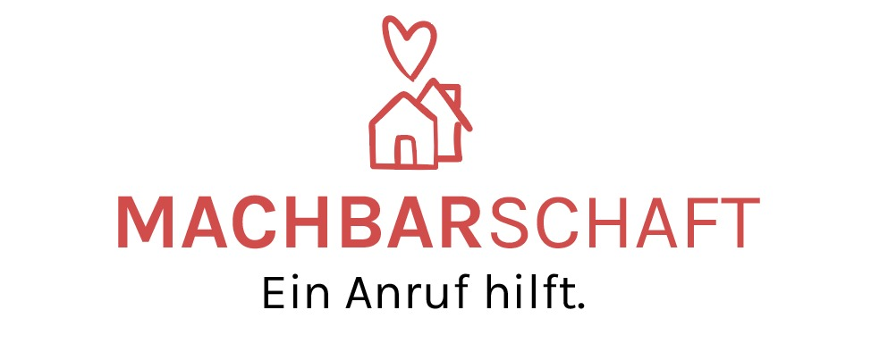

# Machbarschaft
## Firebase/Firestore API

Project Machbarschaft was created in the context of [WirVsVirus Hackathon](https://wirvsvirushackathon.org/) hosted by the German Government. Our pitch video can be found [on youtube](https://www.youtube.com/watch?v=8YJ0I0dMmWg). We also have a [Devpost Profile](https://devpost.com/software/einanrufhilft) and a website [machbarschaft.jetzt](https://machbarschaft.jetzt/). Our main repository is [here](https://github.com/marc-sommer/machbarschaft)

This repository contains the API to connect our Twilio-Bot with a Firebase/Firestore database utilizing Firebase Functions.